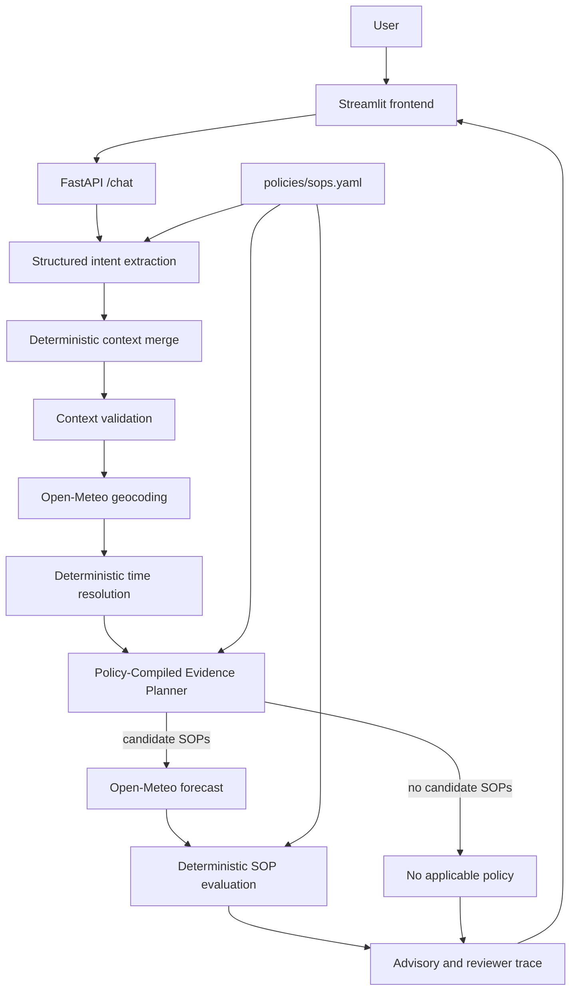

# Weather Advisory Support Bot

## Overview

This repository contains a conversational weather-advisory assistant built for the MediBuddy Brainwave assignment. It interprets a user's location, activity, audience, and time; fetches only the weather facts required by the relevant standard operating procedures (SOPs); and evaluates those SOPs deterministically. The model interprets language; APIs own facts; the SOP engine owns decisions.

## Key Design

The Policy-Compiled Evidence Planner treats the loaded SOPs as the specification for both applicability and required weather evidence. It first selects candidate policies from the canonical conversation context, then walks their condition trees to build the smallest weather request needed for evaluation. An explicitly requested activity outside the SOP vocabulary produces an empty plan and a `no_applicable_policy` response without fetching weather. A message with no activity remains conservative and may consider several policies.

## Architecture



## LangGraph Flow

`backend/src/graph.py` compiles the workflow as:

`extract_intent → merge_context → validate_context → resolve_location → resolve_time → build_evidence_plan → fetch_weather → evaluate_policies → build_advisory`

Conditional branches terminate with explicit responses for intent failure, missing context, location failure, time failure, no applicable policy, weather failure, no triggered policy, and internal configuration errors. An empty evidence plan routes directly to `no_applicable_policy`, so the weather provider is not called when the SOP set does not cover an explicitly requested activity.

## SOP Representation

SOPs are stored as structured YAML so policies can be added or changed without modifying application control flow while remaining machine-readable for deterministic evaluation. The current file contains 12 SOPs with applicability metadata, recursive conditions, severity, priority, guidance, and optional intent examples. A test demonstrates that an additional SOP using an existing supported evidence field automatically participates in intent vocabulary, evidence planning, weather retrieval, and evaluation without a graph change.

## Deterministic vs LLM Responsibilities

The LLM performs:

- structured language interpretation
- fuzzy mapping into canonical policy activities and audiences
- detection of explicit activities not covered by the current SOP vocabulary

Deterministic Python performs:

- conversation-context merge
- timezone-aware time resolution
- evidence planning
- weather fact normalization and authority
- SOP threshold evaluation
- severity and priority ordering
- decision-trace construction

The LLM does not perform date arithmetic, supply weather facts, or decide whether an SOP threshold is crossed.

## Policy-Compiled Evidence Planning

A cycling request demonstrates the flow:

```text
cycling
→ SOP-WIND-CYCLING-01
→ wind_speed_kmh required
→ Open-Meteo requests wind_speed_10m
```

Required fields are collected from policy condition trees, deduplicated, and recorded with the policies that require them.

## Weather Data

The application uses the Open-Meteo Geocoding API and Forecast API. Provider fields such as `wind_speed_10m`, `precipitation`, and `apparent_temperature` are normalized into the typed `WeatherFacts` model. Forecast selection uses the resolved location's timezone and a deterministic target datetime. Missing provider evidence remains explicit rather than being treated as safe.

## Conversation Context

The API passes the client session ID to LangGraph as a `thread_id`. `InMemorySaver` retains location, supported or uncovered activity, audience, and requested time across follow-ups in the same process. A supported activity clears prior uncovered activity state, an uncovered activity clears the prior supported activity, and a turn without activity retains the current activity state.

`InMemorySaver` is process-local. Sessions reset whenever the backend process restarts and are not shared across multiple backend instances.

## Failure Handling

- Missing location returns `missing_context` before geocoding.
- An invalid location returns `location_error`.
- Weather provider or evidence failures return `weather_error`.
- An explicitly uncovered activity returns `no_applicable_policy` and does not request weather.
- Candidate policies with no triggered thresholds return `no_policy_match`.
- Structured extraction failure returns `intent_error`.

`no_policy_match` means that no configured threshold triggered for the fetched evidence. It does not mean that the activity is safe.

## Evaluation

The project has three validation layers:

- **Pytest:** 192 implementation and integration tests pass.
- **Deterministic evaluation:** 20 of 20 graph scenarios pass using controlled intent, geocoding, and weather boundaries.
- **Live evaluation:** `python evals/run_evals.py --live` checks current Open-Meteo integration and real structured LLM extraction separately from deterministic counts.

The severe-heat regression fixture in `evals/fixtures/bhopal_heat_2024-05-20.json` contains an archived Open-Meteo provider row, normalized values, coordinates, timezone, timestamp, endpoint, and retrieval provenance. Each evaluation run regenerates `evals/results.md` from actual outcomes.

## Run Locally

Create and activate a virtual environment, then install dependencies:

```sh
python -m venv .venv
python -m pip install -r requirements.txt
```

Copy `.env.example` to `.env` and configure the required LLM settings. Start the backend from the repository root:

```sh
python -m uvicorn backend.main:app --host 0.0.0.0 --port 8000
```

In a second terminal, start the frontend:

```sh
python -m streamlit run frontend/app.py --server.address 0.0.0.0 --server.port 8501
```

Open `http://localhost:8501`.

## Environment Variables

| Variable | Used by | Purpose |
|---|---|---|
| `LLM_API_KEY` | Backend | Credential for structured intent extraction |
| `LLM_MODEL` | Backend | Structured-output-capable model name |
| `BACKEND_URL` | Frontend | FastAPI base URL; defaults to `http://localhost:8000` |
| `REQUEST_TIMEOUT_SECONDS` | Backend | LLM request timeout |

Keep real values in `.env` or the deployment provider's secret settings. `.env` and Streamlit secret files are ignored by Git.

## Tests

```sh
python -m pytest -q
python evals/run_evals.py
python evals/run_evals.py --live
python -m pip check
```

On Windows systems with restricted temporary-directory permissions, use:

```powershell
.\.venv\Scripts\python.exe -m pytest -q --basetemp=".pytest_tmp"
```

## Adding a New SOP

Add a validated entry to `policies/sops.yaml` with a unique ID, applicability activities and audiences, condition tree, guidance, severity, and priority. Use fields already represented by `WeatherFacts`, or add and test the provider normalization for a genuinely new field. The loader, canonical intent vocabulary, evidence planner, evaluator, and reviewer trace consume the new SOP without graph-control-flow changes.

## Deployment

`render.yaml` defines separate free Render web services for FastAPI and Streamlit. Configure `LLM_API_KEY` and `LLM_MODEL` as backend secrets in Render. The frontend receives the backend's public `RENDER_EXTERNAL_URL` through service linking; no secret is stored in the blueprint. Free services may sleep and restart, which clears the in-memory conversation state.

## Known Limitations

- Conversation state is in memory and resets on backend restart.
- Session state is not shared across multiple backend instances.
- Structured intent extraction depends on the configured model following the constrained schema; the live semantic suite detects regressions but cannot eliminate model variability.
- Advice is limited to configured SOP coverage and the weather fields supported by the current provider adapter.
- Live advisories depend on external weather-provider availability and rate limits; provider failures return `weather_error` rather than fabricated fallback conditions.
